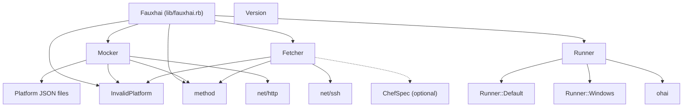
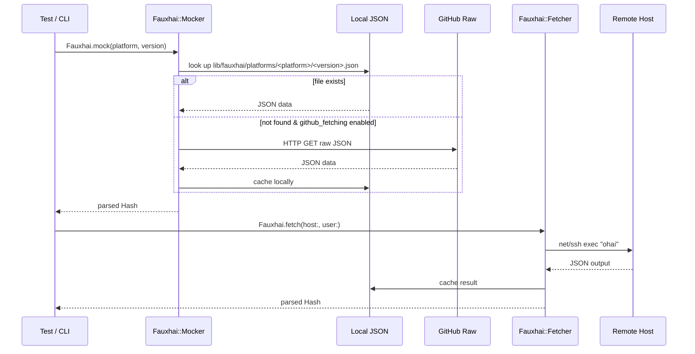

# Fauxhai Architecture

_Auto-generated by `scripts/generate_architecture_diagram.rb` — do not edit manually._

## Overview

Fauxhai is a Ruby gem that provides mock Ohai data for ChefSpec tests.
It has two primary entry points:

- **`Fauxhai.mock`** — returns simulated Ohai data from bundled JSON files
  (via `Fauxhai::Mocker`).
- **`Fauxhai.fetch`** — SSHes into a real node and captures live Ohai data
  (via `Fauxhai::Fetcher`).

The `bin/fauxhai` CLI uses `Fauxhai::Runner` to collect Ohai data on the
current machine and print sanitised JSON.

## Component Diagram

## Module Descriptions

- `Fauxhai::CacheManager` — Centralised JSON file I/O (read/write with mkdir). Used by Fetcher and Mocker for all disk caching.
- `Fauxhai::Exception` — Custom error classes (`InvalidPlatform`, `InvalidVersion`).
- `Fauxhai::Fetcher` — SSHes into a remote host via `net/ssh`, runs `ohai`, and caches the result locally.
- `Fauxhai::Mocker` — Loads platform mock data from local JSON or GitHub. Supports version prefix matching and deprecation warnings.
- `Fauxhai::Runner::Default` — Mixin providing sanitised defaults for Linux/macOS/BSD platforms.
- `Fauxhai::Runner::Windows` — Mixin providing sanitised defaults for Windows platforms.
- `Fauxhai::Runner` — Runs Ohai on the current machine, sanitises the output, and prints JSON. Delegates to platform-specific mixins (`Runner::Default`, `Runner::Windows`).
- `Fauxhai::VERSION` — Gem version constant.

## Platform Data Summary

| Platform | Versions | Count |
|----------|----------|-------|
| aix | 7.1, 7.2 | 2 |
| almalinux | 10, 8, 9 | 3 |
| amazon | 2, 2018.03, 2023 | 3 |
| arch | 4.10.13-1-ARCH | 1 |
| centos | 6.10, 7.7.1908, 7.8.2003, 8 | 4 |
| centos-stream | 8, 9 | 2 |
| clearos | 7.4 | 1 |
| debian | 10, 11, 12, 13, 9.11, 9.12, 9.13 | 7 |
| dragonfly4 | 4.8-RELEASE | 1 |
| fedora | 31, 32 | 2 |
| freebsd | 11.2, 12.1 | 2 |
| gentoo | 4.9.95-gentoo | 1 |
| linuxmint | 19.0 | 1 |
| mac_os_x | 10.14, 10.15, 11, 11.0, 12 | 5 |
| openbsd | 6.2 | 1 |
| opensuse | 15.2, 15.6, 16.0 | 3 |
| oracle | 10, 6.10, 7, 7.5, 7.6, 8, 9 | 7 |
| raspbian | 10 | 1 |
| redhat | 6.10, 7.7, 7.8, 7.9, 8, 9 | 6 |
| rocky | 8, 9 | 2 |
| smartos | 5.11 | 1 |
| solaris2 | 5.11 | 1 |
| suse | 12.4, 12.5, 15 | 3 |
| ubuntu | 16.04, 18.04, 20.04, 22.04, 24.04 | 5 |
| windows | 10, 2012, 2012R2, 2016, 2019, 2022, 8.1 | 7 |

**Total platforms:** 25  
**Total version files:** 72

## Data Flow

## Generation Info

- **Generated at:** 2026-05-27 07:53:02 UTC
- **Script:** `scripts/generate_architecture_diagram.rb`
- **Refresh:** `rake architecture:generate`
