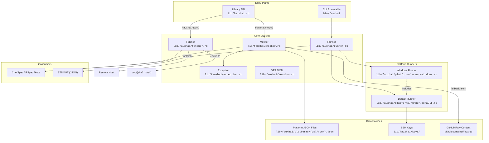
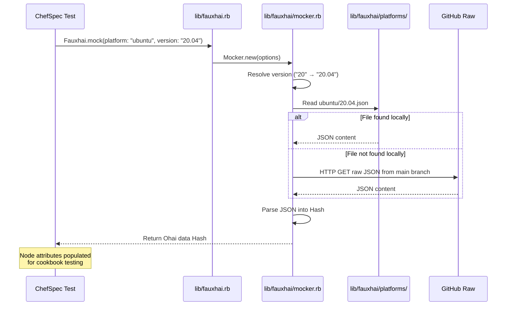
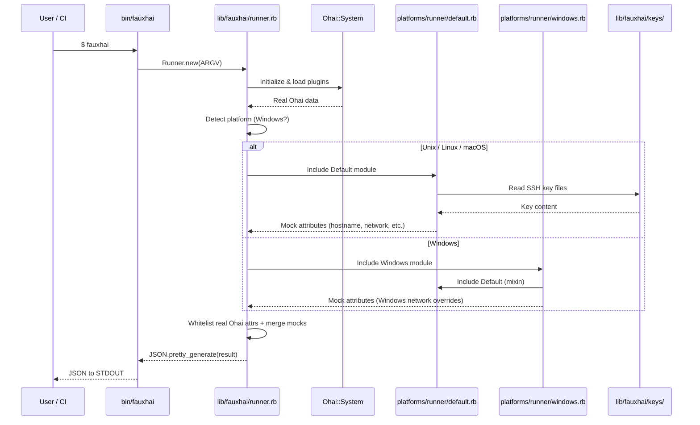
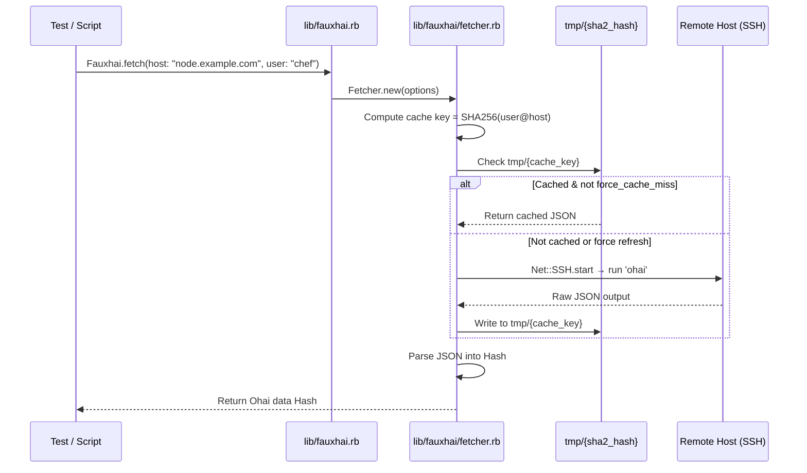
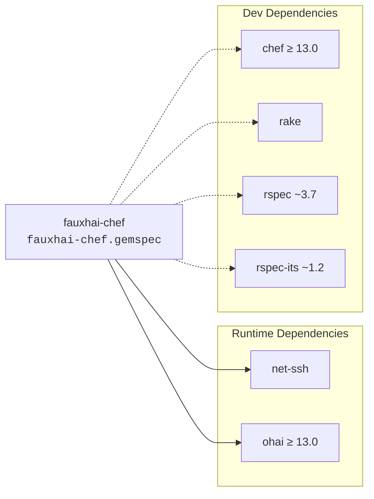

# Fauxhai Architecture

This document maps the conceptual architecture of Fauxhai to actual file paths in the repository and illustrates the primary data flows.

## Module Map

## Data Flow 1 — Mock Data Loading (ChefSpec)

The most common flow: a ChefSpec test loads simulated Ohai data for a specific platform and version.

## Data Flow 2 — CLI Mock Generation

The `bin/fauxhai` CLI generates fresh Ohai mock data by running Ohai locally and merging with mock attributes.

## Data Flow 3 — Remote Ohai Fetch via SSH

Fetch real Ohai data from a remote host over SSH, with local caching.

## Dependency Graph

## Key File Reference

| Concept | File Path | Purpose |
|---------|-----------|---------|
| Library entry point | `lib/fauxhai.rb` | Autoloads modules, exposes `mock()` and `fetch()` |
| CLI entry point | `bin/fauxhai` | Command-line mock data generator |
| Mock data loader | `lib/fauxhai/mocker.rb` | Loads platform JSON locally or from GitHub |
| SSH fetcher | `lib/fauxhai/fetcher.rb` | Fetches real Ohai data via SSH with caching |
| CLI runner | `lib/fauxhai/runner.rb` | Orchestrates Ohai + mock attribute merging |
| Default runner | `lib/fauxhai/platforms/runner/default.rb` | Unix/Linux/macOS mock attributes |
| Windows runner | `lib/fauxhai/platforms/runner/windows.rb` | Windows-specific mock overrides |
| Exceptions | `lib/fauxhai/exception.rb` | `InvalidPlatform`, `InvalidVersion` |
| Version | `lib/fauxhai/version.rb` | `Fauxhai::VERSION` constant |
| Platform data | `lib/fauxhai/platforms/{os}/{ver}.json` | Ohai mock data per platform |
| SSH keys | `lib/fauxhai/keys/` | Mock SSH keys used by runners |
| Gem spec | `fauxhai-chef.gemspec` | Gem metadata, dependencies |
| Build tasks | `Rakefile` | JSON validation, test, doc generation |
| Tests | `spec/` | RSpec unit tests |
| CI | `.github/workflows/ci.yml` | GitHub Actions test pipeline |
